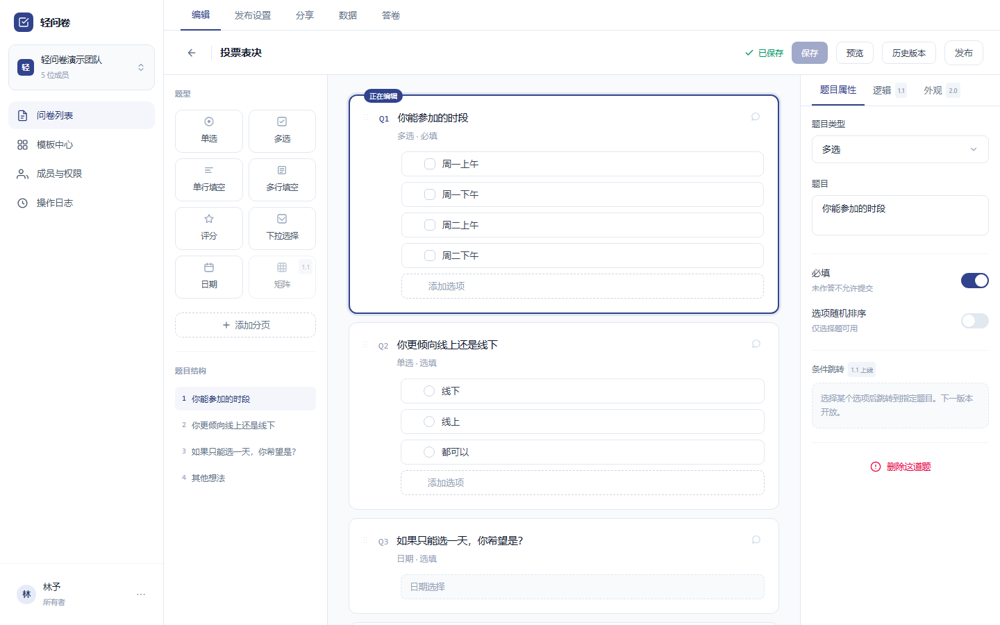
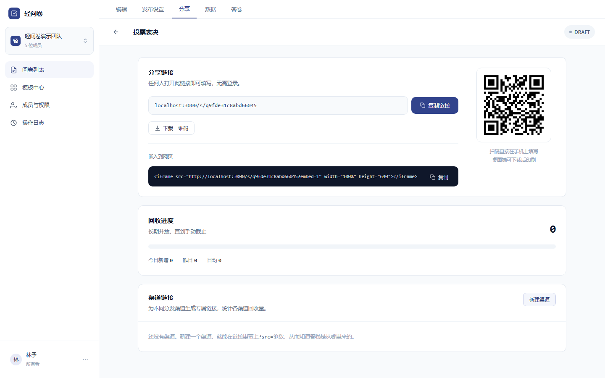
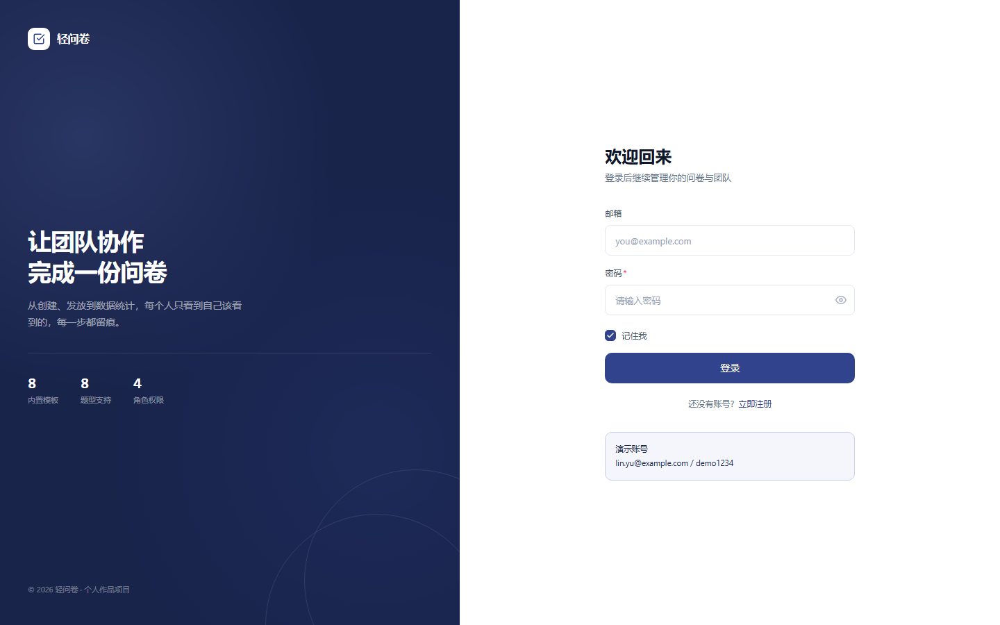
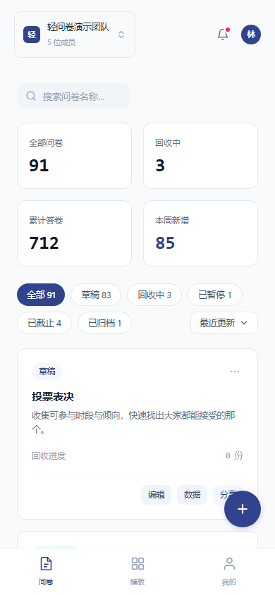

# 轻问卷 · form-maker

一个问卷平台：**建表 → 编辑 → 发布 → 作答 → 统计 → 导出** 全链路，带工作区、成员与权限、模板中心与操作日志。桌面端与窄屏各有一套版式（窄屏是底部三格导航 + 弹层化编辑器）。


| 编辑器                                              | 数据概览                                                 |
| --------------------------------------------------- | -------------------------------------------------------- |
|  |  |

| 分享与二维码                                     | 登录页（演示账号就印在上面）                     |
| ------------------------------------------------ | ------------------------------------------------ |
|  |  |

<p align="center">
  
</p>

## 功能一览

- **问卷**：空白创建 / 从模板创建 / 复制 / 归档恢复 / 删除；八种题型（单选、多选、单行填空、多行填空、评分、下拉选择、日期、矩阵）；分行分页、题目属性（必填、选项随机、评分刻度、矩阵行列）、条件显示（只有选了「不满意」才出现的追问）与拖拽排序。
- **发布与分发**：发布前检查清单、开始 / 截止时间、回收份数上限、作答身份（匿名 / 需登录 / 口令访问）、二维码与渠道链接、暂停 / 恢复 / 截止。
- **作答**：公开链接 `/s/<slug>`，草稿自动恢复、提交结果页、口令解锁（10 分钟 5 次限流）、重复提交拦截。
- **统计与答卷**：口径条 + 逐题图表、答卷明细（筛选 / 搜索 / 标无效 / 恢复）、导出 CSV / JSON（带 BOM）。
- **协作**：工作区与成员（所有者 / 管理员 / 编辑者 / 查看者四档）、邀请链接（7 天有效、邮箱校验）、权限矩阵、操作日志（可筛选、可导出）。
- **模板中心**：公开模板池（官方 8 张 + 各工作区已公开的，卡片标明来源）、我的模板（另存为 / 设为公开 / 收藏 / 重命名 / 删除）、预览；公开带四道闸门（管理员 · 每区 10 张上限 · 内容门槛 · 限流），可随时取消公开。
- **版本**：每次保存留版本快照，可看历史、可回滚（已发布问卷的结构是冻结的）。

## 技术栈

| 层         | 选型                                                                       |
| ---------- | -------------------------------------------------------------------------- |
| 框架       | Next.js **16.3.8**（App Router / RSC / Server Actions）· React **19.2.8**  |
| 样式       | Tailwind CSS **4**（设计令牌 + `prettier-plugin-tailwindcss` 统一类序）    |
| 数据       | Prisma **7.10**（`@prisma/adapter-pg`，无 Rust 引擎）· PostgreSQL（Neon）  |
| 校验       | zod **4**（表单与服务端共用同一份 schema）                                 |
| 组件       | Radix UI（dialog / dropdown / tabs / toast …）· dnd-kit（排序）· qrcode    |
| 口令与令牌 | `@node-rs/argon2`（账号密码）· cookie 会话（库里只存令牌哈希）             |
| 质量       | TypeScript · ESLint · Prettier · Husky + lint-staged · Vitest · Playwright |

## 快速开始

**要求**：Node 20 以上（开发用 24.14）· pnpm 10（`packageManager` 已锁定 `pnpm@10.33.0`）· 一个 PostgreSQL（本项目用 [Neon](https://neon.tech) 免费版）。

```bash
# 1) 依赖
pnpm install

# 2) 环境变量：复制模板后填三个值（见下表）
cp .env.example .env

# 3) 建表 + 灌演示数据
pnpm db:deploy     # 应用迁移（已有库用这个；改 schema 时用 pnpm db:migrate）
pnpm db:seed       # 幂等，可反复跑

# 4) 起开发服务
pnpm dev           # http://localhost:3000
```

### 环境变量

| 变量                  | 说明                                                                                                                                                                         |
| --------------------- | ---------------------------------------------------------------------------------------------------------------------------------------------------------------------------- |
| `DATABASE_URL`        | **池化**连接串：Neon 控制台里带 `-pooler` 的主机名。应用运行时走它                                                                                                           |
| `DIRECT_URL`          | **直连**连接串（不带 `-pooler`）。迁移与 `db:*` 脚本走它——DDL 不适合经连接池转发                                                                                             |
| `NEXT_PUBLIC_APP_URL` | 站点的公开地址（本地 `http://localhost:3000`）。邀请链接、渠道链接与二维码都按它拼接。**部署到 Vercel 时可以留空**——没配就自动取平台注入的生产域名（预览部署取本次部署域名） |

> 三个值都在 Neon 的 **Connection Details** 面板里，切换「Pooled / Direct」各复制一次即可。项目**没有**其它密钥（会话令牌随机生成、库里只存哈希）。

## 演示账号与演示数据

| 角色           | 邮箱                  | 密码       |
| -------------- | --------------------- | ---------- |
| 所有者（林予） | `lin.yu@example.com`  | `demo1234` |
| 查看者（陈默） | `chen.mo@example.com` | `demo1234` |

登录页上就印着这两个账号（演示项目，刻意如此）。此外：

- `pnpm db:seed` 会建一个演示工作区（轻问卷演示团队）与 4 位成员、若干问卷与模板；
- 有一条**固定 token 的待接受邀请**：打开 `/invite/demo-invite-li-meng` 可以直接走一遍「接受邀请」（演示数据里的邀请不该是谁也点不开的死链接）；
- 想从零开始：`pnpm db:seed` 是幂等的，重复跑不会堆数据。

## 常用命令

| 命令                                                      | 作用                                                     |
| --------------------------------------------------------- | -------------------------------------------------------- |
| `pnpm dev` / `pnpm build` / `pnpm start`                  | 开发 / 构建 / 起生产服务                                 |
| `pnpm typecheck`                                          | `next typegen` + `tsc --noEmit`                          |
| `pnpm lint` / `pnpm format`                               | ESLint / Prettier（提交时由 husky + lint-staged 自动跑） |
| `pnpm test`                                               | Vitest 单测（`test:watch` 为监听模式）                   |
| `pnpm e2e`                                                | Playwright 端到端（**先清残留**再跑，见下）              |
| `pnpm db:deploy` / `db:migrate` / `db:seed` / `db:studio` | 迁移 / 建迁移 / 灌数据 / 可视化                          |
| `pnpm db:check`                                           | 探活与环境自检（打印往返延迟）                           |
| `pnpm db:purge-e2e`                                       | 清掉历次 E2E 留下的数据（`pnpm e2e` 会自动先跑它）       |
| `pnpm db:prune-logs` / `db:prune-invitations`             | 按保留期清理日志 / 过期邀请（部署时挂定时任务）          |

**跑 E2E 前知道四件事**：① 它写数据库，且**开头会清残留**——会删掉标题以 `E2E ` 开头的问卷与**所有「未命名问卷」**（没命名的草稿请先起名）；② 想跑构建产物就 `pnpm build` 后带 `E2E_USE_BUILD=1`（默认端口 `3100`，可用 `E2E_PORT` 改）；③ 数据库在境外，首条用例前会先预热并在偏慢时给出提示；④ 想打**已部署的站点**（生产冒烟）就设 `E2E_BASE_URL`，此时不会自起服务——但**只跑只读用例**，整套会写库。

## 项目结构

```
src/
  app/                    路由（App Router）
    (auth)/               登录 / 注册
    app/                  管理台外壳 + 问卷列表 / 编辑器 / 发布 / 分享 / 数据 / 答卷 / 模板 / 成员 / 日志 / 我的
    s/[slug]/             公开作答页与结果页
    invite/[token]/       接受邀请
    api/health            探活（给 E2E 预热用）
  features/<域>/          按业务域切分：api/（查询）、actions/（Server Actions）、components/、lib/、schemas.ts
  components/             跨域共用组件（layout / ui / questionnaire / icons）
  lib/                    auth（会话、权限）、db（唯一的数据访问出口）、operation-log、questionnaire-version …
  config/                 constants（含演示账号、共享常量）、env（环境变量校验）
prisma/                   schema.prisma · migrations/ · seed.ts
e2e/                      Playwright 用例 + global-setup（预热数据库）
scripts/                  运维脚本（探活、清理、清 E2E 残留）
docs/                     PLAN.md（里程碑与遗留总表）· VERIFY.md（人眼走查）· DEVICE-SETUP.md
```

## 工程约定（改动前请先读 `AGENTS.md`）

- **数据访问只有一个出口**：组件与 Server Action 都不得自己 `new PrismaClient()`；查询写在 `src/features/<域>/api/*.ts`，首行 `import 'server-only'`。
- **features 之间禁止互相导入**；跨域共用的组件一律上提到 `src/components/`。
- **界面只是不给入口，拦截在服务端**：真正的权限判断在每个数据函数与 action 里（`requireUser` / `requireMembership` / 权限矩阵）。
- **已发布问卷的结构是冻结的**：编辑器保存 / 版本回滚 / JSON 导入都要求草稿状态 —— 历史答卷与统计口径都挂在那份结构上。

## 质量门

```bash
pnpm typecheck && pnpm lint && pnpm test && pnpm build && pnpm db:check && pnpm e2e
```

最近一次全量（2026-10-09）：`typecheck` ✓ · `lint` ✓ · `test` ✓ **154 passed** · `build` ✓ · `db:check` ✓ · `e2e` ✓ **65 passed / 47 skipped / 0 failed**（两个 project 各跑一轮：desktop 46 + mobile 19；skipped 是用例里显式跳过的：写库类只在桌面项目跑、窄屏专属项在桌面项目下跳过、拖拽排序因 E2E 驱动不了 dnd-kit 的 drop 而留手工验证）。

## 已知取舍（演示项目范围内的决定）

- **口令访问的口令存原文**：它是发起人要发出去的访问码，必须能再看到（哈希则读不回来）。代价是拿到数据库的人也能读到 —— 要收紧就在这一列上做静态加密。
- **口令试错限流在进程内存里**：多实例不共享、重启清零。演示够用；上线换 Redis 只改一处。
- **统计是「读进内存再算」**：演示规模够用；十万份级需要改成数据库聚合。
- **模板公开没有审核后台**：个人作品不引入平台级审核角色；靠四道闸门（管理员 · 每区 10 张上限 · 内容门槛含描述必填 · 限流）+ 可撤销 + 操作日志 + 来源透明兜底。

## 部署

`vercel-build` 脚本已就绪（`prisma migrate deploy && prisma generate && next build`）。生产环境只需在 Vercel 里配好 `DATABASE_URL` 与 `DIRECT_URL`（**`DIRECT_URL` 别漏**，迁移要走直连主机）——`NEXT_PUBLIC_APP_URL` 可以留空，会自动取平台注入的生产域名。演示数据随 Neon 分支一起复制过去，不必重新 seed。进度与待办见 `docs/PLAN.md` 的 M11 一节。
